## Introduction

In this demonstration we will show you the very basic way in which you can create a computer cluster (a Kubernetes cluster to be exact) in the cloud so you can do some data processing and analysis using those resources.  In the process we will make sure you learn about the jargon.  During the hands-on session tomorrow, a cluster similar to this one will be provided to you for the exercises.  

## Creating your own cluster on GKE

For the hands-on part of this lesson you will not have to create the cluster for yourself, it will be already done for you.  For pedagogical reasons, however, we will show an example of how to do it by hand.  The settings below should be good and cheap enough for CMSSW-related workflows.

* Get to the Console
* Create a new project or select one of your interest (if you already have one)
* Click on the Kubernetes engine/clusters section on the left side menu

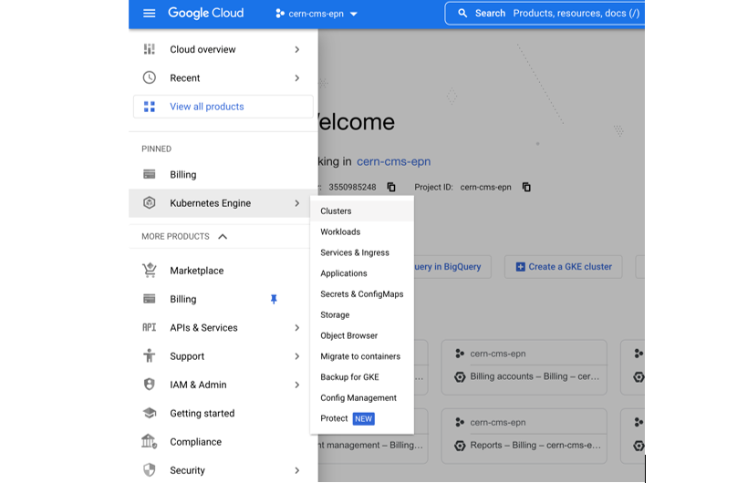
* Select create cluster (standard)

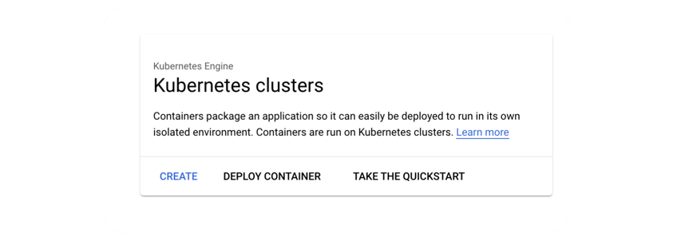
* Select GKE Standard
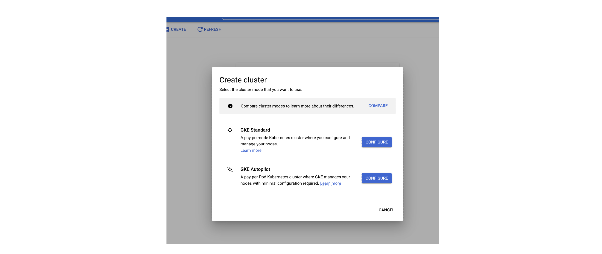
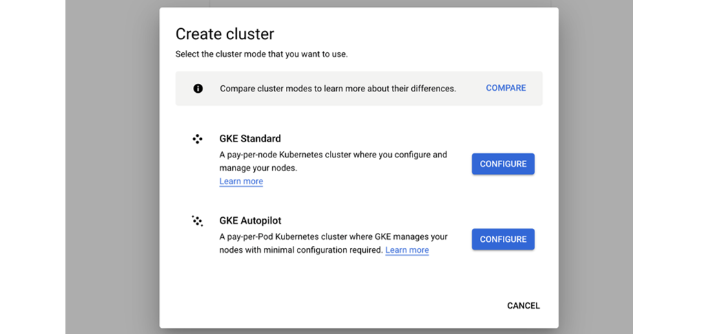
* Give it a name
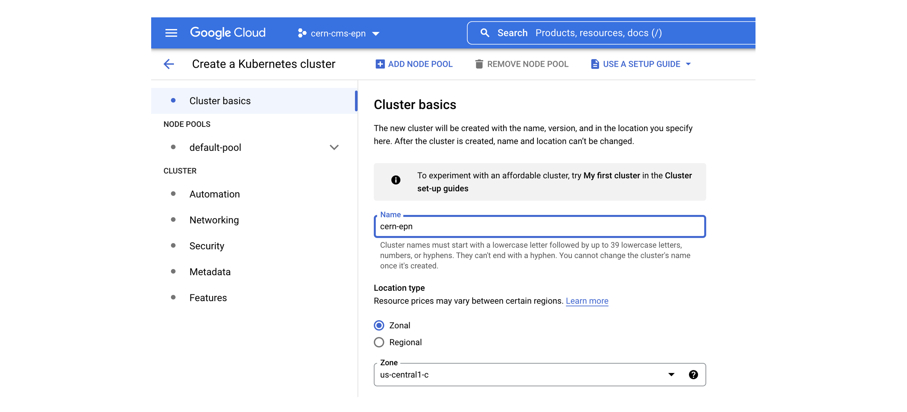
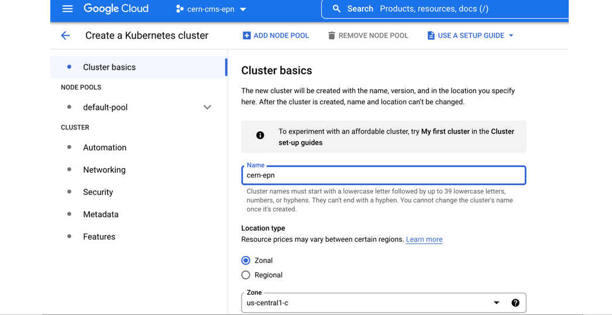
* Many ways to configure the cluster, but let's try an efficient one with autoscaling
* Go to default pool
* Choose size: 1 node
* Autoscaling 0 to 4
  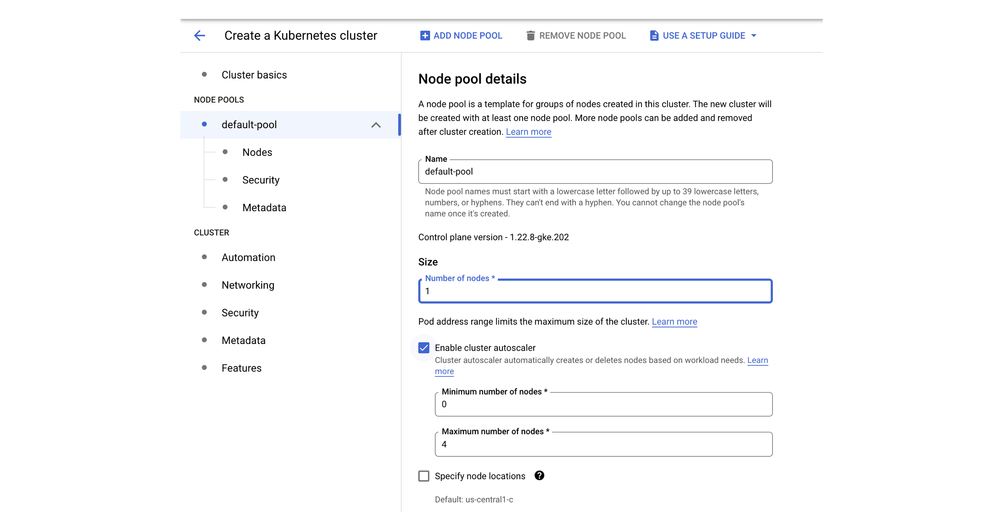
  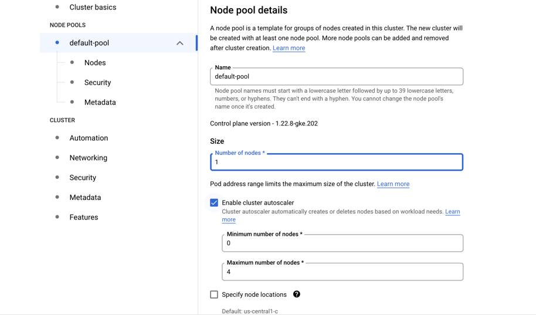
* Go to Nodes
* Choose a machine e2-standar-4
* Leave the rest as it is
* Hit create
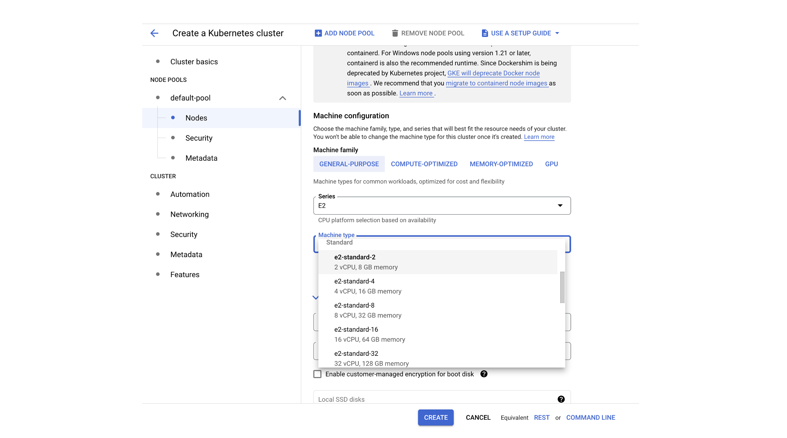
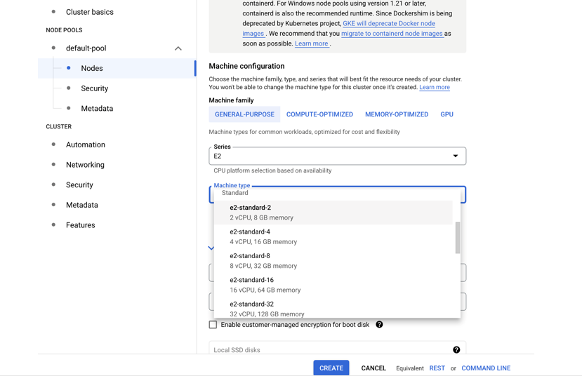
* Creation will take while

While we wait, lets inspect the Cloud shell...

## Cloud shell

GCP provides an *access machine* so you can interact with their different services, including our newly created K8s cluster.  This machine (and the terminal) is not really part of the cluster. As was said, it is an entry point.  From here you could *connect* to your cluster.

## The `gcloud` command

The gcloud command-line interface is the primary CLI tool to create and manage Google Cloud resources. You can use this tool to perform many common platform tasks either from the command line or in scripts and other automations.

## Connect to your cluster

Once the cluster is ready (green check-mark should appear)

* Click on the connect button of your cluster:
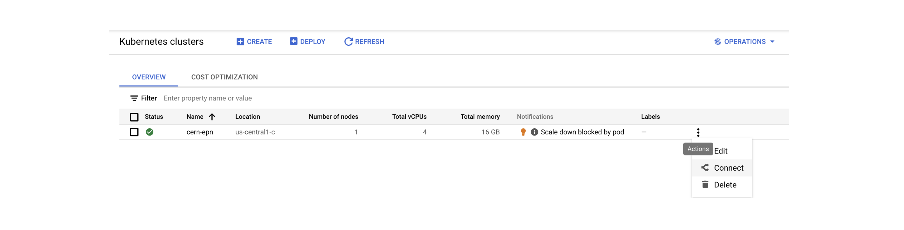
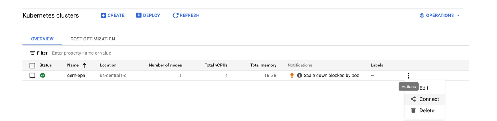
* Execute that command in the cloud shell:

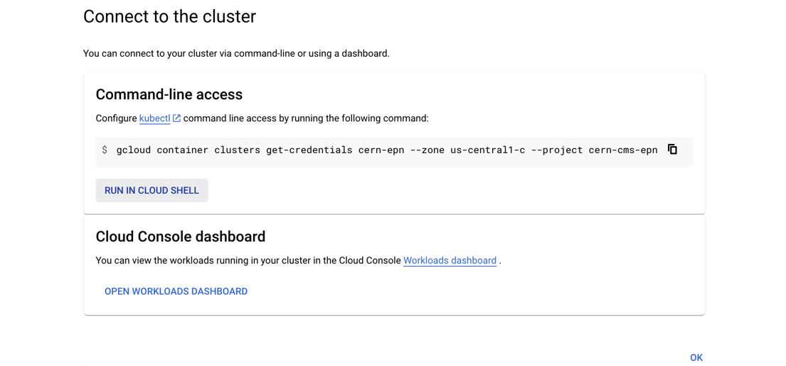

* You’ve connected to your shell, now press enter to link to your GKE cluster:
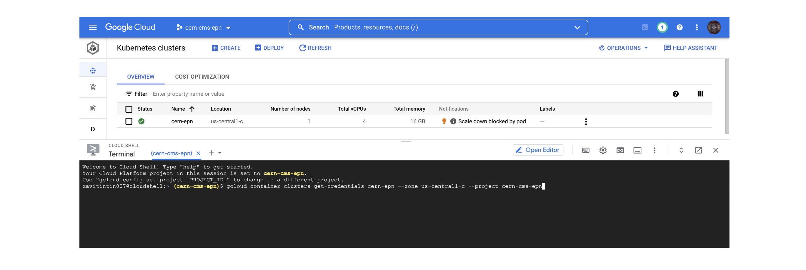
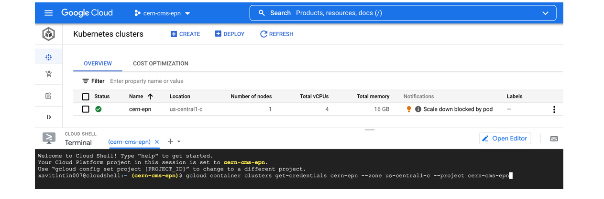

* Authorize Shell

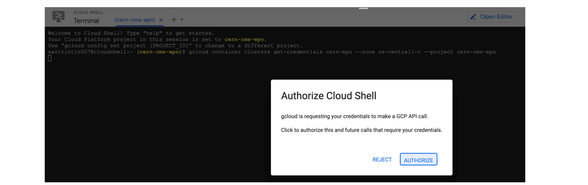

