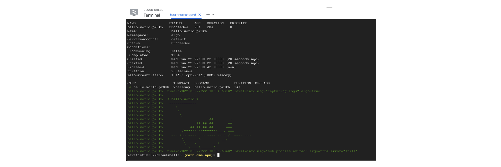

## Install argo as a workflow engine

While jobs can also be run manually, a workflow engine makes defining and
submitting jobs easier. In this tutorial, we use
[argo](https://argoproj.github.io/argo/quick-start/).
Install it into your working environment with the following commands
(all commands to be entered into the cloud shell):

```bash
kubectl create ns argo
kubectl apply -n argo -f https://raw.githubusercontent.com/argoproj/argo-workflows/master/manifests/quick-start-postgres.yaml`
curl -sLO https://github.com/argoproj/argo/releases/download/v2.11.1/argo-linux-amd64.gz
gunzip argo-linux-amd64.gz
chmod +x argo-linux-amd64
sudo mv ./argo-linux-amd64 /usr/local/bin/argo
```

This will also install the argo binary, which makes managing the workflows
easier.

> ## Reconnecting after longer time away
>
> In case you leave your computer, you might have to reconnect to the CloudShell
> again, and also on a different computer. If the `argo` command is not found,
> run the command above again starting from the `curl` command.
>
{: .callout}

You need to execute the following command so that the argo workflow controller
has sufficient rights to manage the workflow pods.
Replace `XXX` with the number for the login credentials you received.

```bash
kubectl create clusterrolebinding cern-cms-cluster-admin-binding --clusterrole=cluster-admin --user=cms-gXXX@arkivum.com
```

You can now check that argo is available with

```bash
argo version
```

We need to apply a small patch to the default argo config. Create a file called
`patch-workflow-controller-configmap.yaml`:

```yaml
data:
  artifactRepository: |
    archiveLogs: false
```

Apply:

```shell
kubectl patch configmap workflow-controller-configmap -n argo --patch "$(cat patch-workflow-controller-configmap.yaml)"
```

## Run a simple test workflow

To test the setup, run a simple test workflow with

```bash
argo submit -n argo --watch https://raw.githubusercontent.com/argoproj/argo/master/examples/hello-world.yaml
argo list -n argo
argo get -n argo @latest
argo logs -n argo @latest
```
* Wait till the yellow light turns green
* If argo was installed correctly you will have the following:


Please mind that it is important to delete your workflows once they have
completed. If you do not do this, the pods associated with the workflow
will remain scheduled in the cluster, which might lead to additional charges.
You will learn how to automatically remove them later.

```bash
argo delete -n argo @latest
```

> ## Kubernetes namespaces
>
> The above commands as well as most of the following use a flag `-n argo`,
> which defines the namespace in which the resources are queried or created.
> [Namespaces](https://kubernetes.io/docs/concepts/overview/working-with-objects/namespaces/)
> separate resources in the cluster, effectively giving you multiple virtual
> clusters within a cluster.
>
> You can change the default namespace to `argo` as follows:
>
> ~~~
> kubectl config set-context --current --namespace=argo
> ~~~
> {: .bash}
>
{: .testimonial}
