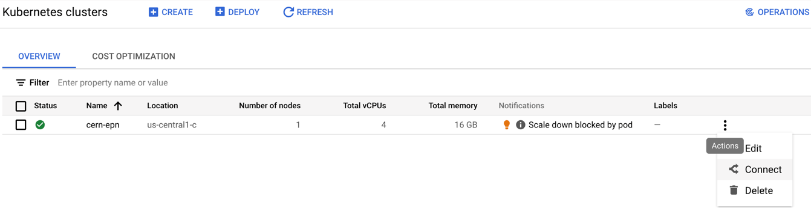
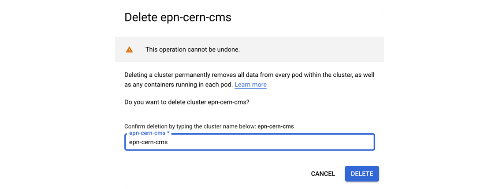
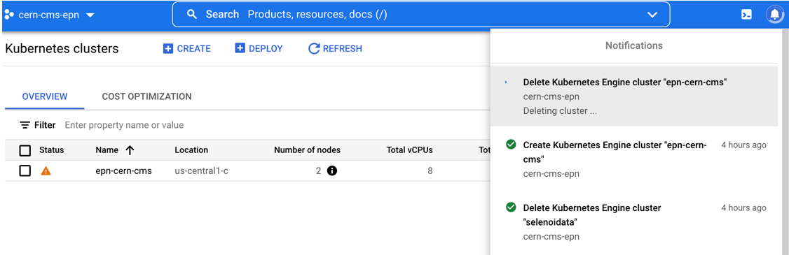

## Cleaning workspace

Remember to delete your workflow again to avoid additional charges:
Run this until you get a message indicating there is no more workflows.

```bash
argo delete -n argo @latest
```

Delete the argo namespace and all yaml files and configurations with:

```bash
kubectl delete ns argo
rm *
rm -r *
```

Delete your disk:
```bash
gcloud compute disks delete DISK_NAME [DISK_NAME …] [--region=REGION     | --zone=ZONE]
```

> ## Demo delete disk
>
> To delete the disk 'gce-nfs-disk-1' in zone 'us-central1-c' that was used as an example in this workshop , run:
>
> ```bash
> gcloud compute disks delete gce-nfs-disk-1 --zone=us-central1-c
> ```
>
{: .testimonial}

## Delete cluster

* Click on the delete button of your cluster:


* Confirm deletion:


* Standby to see the complete deletion of the cluster:

Perfect you’re ready to start over
