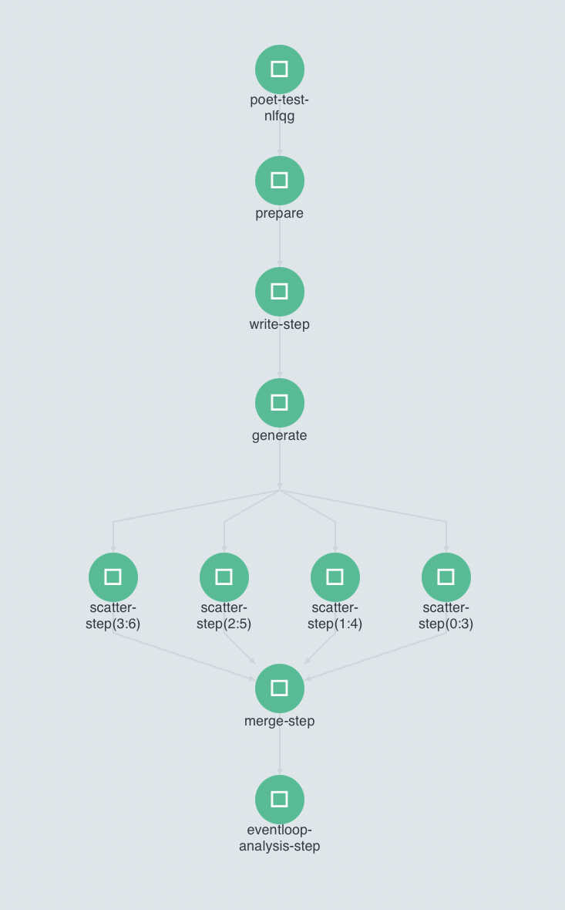
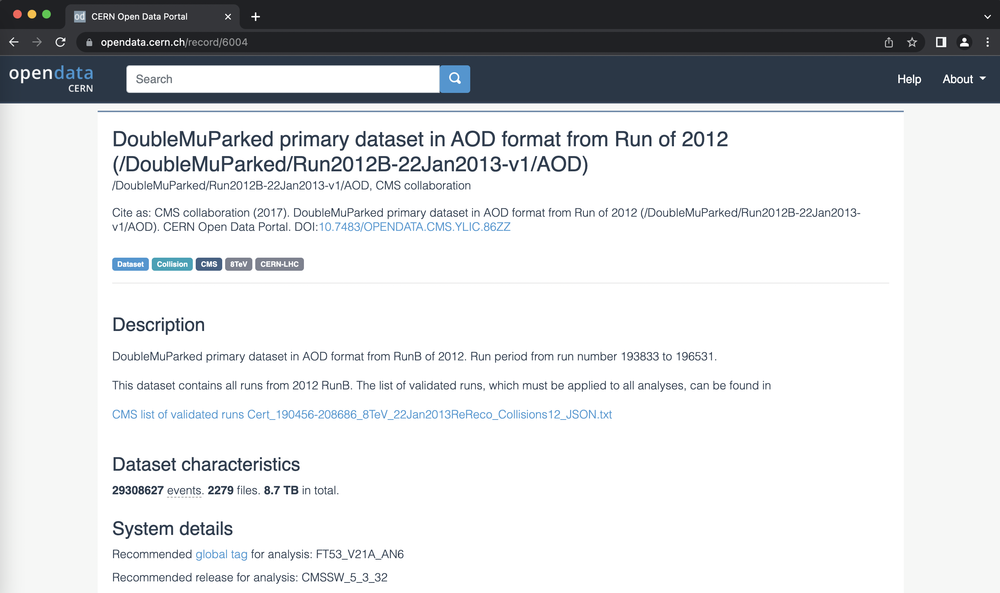

## Expanding the Yaml File

Now we are going to run a serious workflow.  We will be mimicing a full analysis flow by going through a more complex and complete workflow.

In order to run an analysis on multiple datasets, some changes have to be made to the structure of the yaml file.  First, download the yaml file with:

```bash
wget https://raw.githubusercontent.com/cms-opendata-workshop/workshop2021-poetpayload-cloud/master/PhysObjectExtractor/cloud/workshop_argo.yaml
```
This file needs to be updated. I have the updated version, it just needs to be pushed to the github.

Open up the file, and take a look through its contents.  Below is an explanation of the major changes compaired to the previous workflows you have run.

Instead of having one task that runs when the workflow is submitted, workshop_argo.yaml calls and runs multiple different tasks.  The file is broken up into different templates.  

1. "example", the first template, is the entrypoint, and it contains the outline for the rest of the workflow.

2. "prepare-template" gets the directories ready for other workflow steps.  

3. "write-files-step-template" makes a text file containing all the files that are going to be processed by the workflow.  

4. "gen-list-template" sets up the iterator list.  

5. "scatter-step-template" processes the data, and it will take the longest amount of time to complete.  

6. "merge-step-template" combines the multiple outputs files from the processing in one file.  

7. "eventloop-analysis-step-template" prepares some histograms using the output file from the merge step.  

The first template must have the same name as the the entrypoint value, which is declared close to the top of the file.  Under the `dag` section of the first template, it calls other templates that are defined below.  It also contains information such as arguments to pass into each of these sections and dependencies that ensure the templates are run in the correct order.

The fifth template uses scattering to run the analysis.  It runs the code specified within in mutliple pods at the same time.  The Argo GUI helps us visualize this process.



The number of pods increases depending on how many files you are trying to run. Depending on the resources you allocate to you cluster, there is a limit to the number of pods you have running at one time.  If you have more pods than this number, they will wait for eachother to complete.  

## Accessing and Using Data Sets

The first step is to get the record number or recid, which can be found in the end of the url of the dataset. For example, in the dataset shown below, the recid is 6004.



Each dataset must be done seperately, but all the files in a dataset can be run at the same time.  Next, take the record number use it to replace the existing value under recid in your yaml file.  

```yaml
arguments:
    parameters:
    - name: processName                                  
      value: 'DoubleMuParked'
    - name: firstFile                                  
      value: 3
    - name: nFiles                               
      value: 4
    - name: nEvents                               
      value: 1
    - name: recid
      value: 6004 
```

All of the parameters in arguments can be changed depending on the analysis being done.  
- processName is used in the name of the output file
- firstFile selects which file to start with, and it starts with 1.  
- nFiles is the number of files you want to process. 
- nEvents is the maximum number of events you want it to process. If you want it to run over all of the events, set it to -1.  

After the yaml file has been edited, run the workflow with the following command. Remember to change nfs-<ID> to your ID number.

```bash
argo submit -n argo workshop_argo.yaml --watch
```

You can watch it's progress either on the command line or in the Argo GUI.  When it has finished, you will be able to access the output files by using the commands:

```bash
kubectl cp pv-pod:/mnt/data /tmp/poddata -n argo
kubectl cp /tmp/poddata/FILENAME .
```

Replace FILENAME with any output file you want to access. The output files from this example are histograms.root, . I can't run workflows right now, and I will add in the list of output files when I can.  

There are many different ways to use a workflow, and they can be customized to fit a variety of needs.  Now you are able to edit a yaml file to perform a full analysis flow.